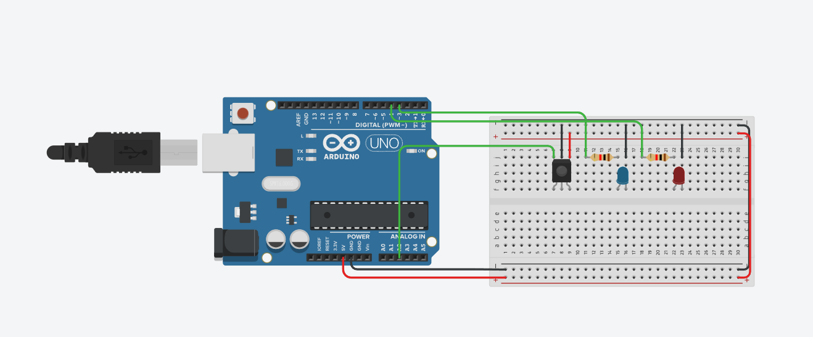
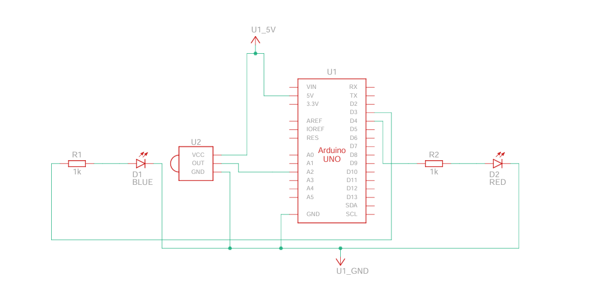

# Control your computer with an infrared remote

Use an infrared remote to control your computer, when i say control, i mean basic functionnalities like left and right click, mouse movements, etc..

To do so, i used an arduino uno and an infrared receiver. The arduino sends to a python script what button was pressed and the action related to the button is executed by the python script
using the pyautogui library.

I must warn you that i am not a professionnal programmer, so my explanation of the project, or my code may not be very good and far from being perfect.
So be careful if you want to use my code for your personal use.

If you have comments, remarks or advices don't hesitate to let me know them !!

## Installation

All of the python library used in the python scripts are in the requirements.txt file.
To install them on your computer or in your virtual environnement just do the following command with the package manager [pip](https://pip.pypa.io/en/stable/) :

```bash
pip install -r requirements.txt
```

Please notice that if you're using a virtual environnement you will need to be in it before installing the requirements.
After installing all of the required modules, you can delete the requirementst.txt file.

For the arduino part, you'll need the IRremote (4.2.0) library (Tools -&gt; Manage libraries)
For the circuit you can do as in the following image:





If you know how to use arduino, you'll just need and ir receiver and an ir remote. You can add the leds (that light up if the left or right click is pressed) if you want too.

#### BE CAREFUL THE PYTHON PROGRAM SHOULD BE THE ONLY ONE USING THE ARDUINO'S PORT

Or else you will have an error like the following one:

```bash
serial.serialutil.SerialException: could not open port 'com6': PermissionError(13, 'Accès refusé.', None, 5)
```

## Modifications that may be needed

You may not the same pin configuration as me, or not the same remote as me, so here's a list of things you may need to changes for it to work.

### 1.

Change the com port of the arduino, yours may not be 6 like mine.
Change this in the line 25 of the python script, or the one with the comment above saying it.

### 2.

If you didn't used the same pins as me(which is totally alright), you'll just need to change them in the arduino program line  2 for the IR receiver and 11 and 12 (ledPinOne / ledPinTwo) for the leds if you added them.

### 3.

If you didn't used the same remote or will not use a different remote as me, you will need to change a dew things.
First, in the arduino code, you will need to change the commands, add a

```bash
Serial.println(IrReceiver.decodedIRData.command)
```

just so you see what code is being sent out when you press a certain button. You can see the result of the print in the "Serial Monitor" tab at the bottom of the screen. If the tab doesn't show up, go to Tools-&gt;Seral Monitor.
Now that you know which command is being sent out, copy and paste it after the "case" in the switch statement.

```bash
case [paste it here]:
    [rest of code]
```

If you wish to add more functionnalities by yourself, maybe change what is being printed out by the switch statement, they are the name of the buttons of MY remote. You will also have to change them in the python script.

#### BEFORE LEAVING

Please be careful with what is being sent out in the Serial Monitor, everything that is sent in it is retrieved by the python script and used as an input. Having other things beside the remote output in it could cause problems.

## Features

- Normal left an right click (press-&gt;unpress)
- mouse mouvement in all directions
- Scroll up / scroll down
- Leave pressed left / right click, Unpress left / right click
- Increase or decrease the "sensitivity", impact the mouse mouvement and scrolling lenght

## FAQ

#### Will i update the code ?

Yes of course, if i get feedback on something, or if i find a way to do thing more efficiently i will definitly update the code !

#### Will i add more functionalities ?

Maybe yes, i don't want to add a lot and a lot of functionalities because i want everyone to be able to use my program, if i add to much functionalities like lcd screen support, some people that don't have one or don't want to have one will be bothered by it. I need to make the things that i add optionnal and adaptable and this is a difficult task, even more for me because i am a beginner.

## Feedback

If you want to contact me regarding the program or other things related to programming, i will soon make an email specially made for this.

If you just have problems with the program, just open a issue !!

## Im new to github.... How do i download the files ?...

Hey, there's a first time for everybody, so here's the simple way to do it:
1. Click on the green button with '<>Code' written on it.
2. Then click "Download zip" and there you go ! The final step is to extract the .zip with the software of your choice !!

You may ask yourself  what are the README.md file or the images folder, to answer your question, they are what you're seeing right now !!!
So yes, you can delete them. They will not affect the ability of the program to run.
